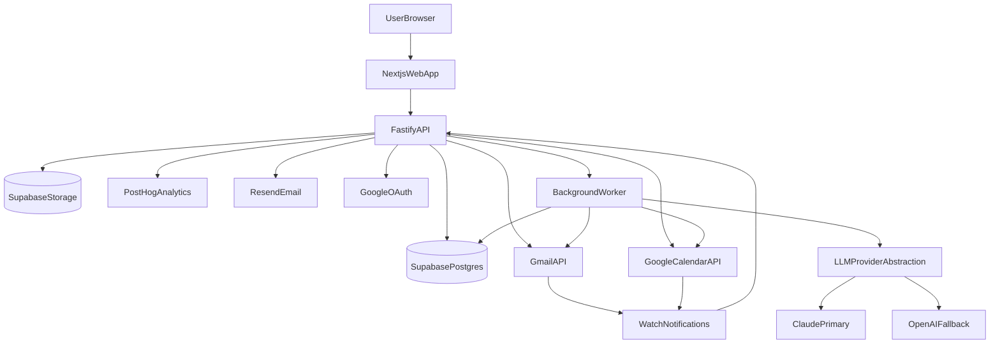

# Technical Design Document: Keystone v1 MVP

**System:** Keystone (v1, single-user first)  
**Goal:** Gmail + Google Calendar → Today Command Center with receipts-first summaries and safe drafting (no auto-send).  
**Primary risk to de-risk:** Sync correctness (duplicates, missed items, drift) with strong observability and repair flows.  
**Target timeline:** ~4 weeks (per PRD gates)  
**Budget target:** \(\le\) $50/mo (excluding founder’s dev tools; LLM usage tightly bounded)

---

## Executive Summary

Keystone v1 is a web-first premium “command center” that reads Gmail + Calendar and produces:

- **Today view**: prioritized items with **explainable rationale**
- **Receipts-first summaries**: every claim backed by evidence IDs and optionally minimal snippets
- **Safe drafting**: user-approved drafts, copy-to-clipboard minimum; optional Gmail Draft creation via incremental scope
- **Controls**: retention settings + delete-my-data that deletes + PII-safe observability/audit trail

This design optimizes for:
- **Correctness** over cleverness: idempotency, delta sync, drift detection, repair jobs
- **Trust**: receipts, conservative outputs, no auto-send, injection-safe LLM patterns
- **Privacy**: least-priv Google scopes + PII-safe logs + deletion semantics

---

## Architecture Overview

### High-level

### Components

- **Web app (Next.js on Vercel)**: UI (Today, Thread/Meeting detail, Weekly brief, Settings), auth session, polling for updates.
- **API (Fastify on Railway)**: OAuth connect flows, webhook endpoints, read models for UI, draft creation endpoints, settings/deletion endpoints.
- **Worker(s) (Railway)**: ingestion, sync repair, summarization/drafting jobs, weekly brief jobs.
- **Supabase**: Postgres primary store (+ RLS where useful), Supabase Auth (magic link), Supabase Storage (optional artifacts/exports).
- **LLM providers**: Claude primary, OpenAI fallback behind a single interface with strict grounding rules.
- **Observability**: PII-safe structured events to logs; audit events stored in DB; product analytics to PostHog (no raw content).

---

## Major Technical Decisions (Alternatives, Recommendation, Trade-offs)

### 1) Hosting for Next.js (web)

**Options**
- **Vercel (recommended)**  
  - Pros: fastest Next.js deploys, preview URLs, edge caching, good DX, simplest for MVP speed
  - Cons: can get pricey with scale; some vendor lock-in around Next primitives
- **Cloudflare Pages/Workers**  
  - Pros: strong global edge, potentially lower cost at scale
  - Cons: Next compatibility constraints; more “platformy” complexity; may slow MVP iteration
- **Self-host (Fly.io/Railway)**  
  - Pros: full control, simpler single provider story
  - Cons: more ops; harder to beat Vercel DX for Next

**Recommendation**: **Vercel** for v1 speed.  
**Trade-off**: accept some platform coupling; keep web ↔ API boundary clean to preserve portability.

### 2) Hosting for API + workers

**Options**
- **Railway (recommended)**  
  - Pros: very fast to ship; supports always-on services for webhooks/workers; simple secrets; easy staging/prod separation
  - Cons: cost can creep; fewer “enterprise” knobs than AWS
- **Fly.io**  
  - Pros: great for long-running services; region control; solid networking
  - Cons: slightly more infra work; learning curve
- **Serverless (functions + queues)**  
  - Pros: pay-per-use; scales automatically
  - Cons: webhooks + long/complex sync workflows become trickier; cold starts; queue plumbing; local dev complexity

**Recommendation**: **Railway** for API + worker in v1.  
**Trade-off**: You’ll want basic guardrails (timeouts, backoff, quotas) to avoid surprise bills.

### 3) Background job queue strategy under \(\le\) $50/mo

**Options**
- **Postgres-backed queue (recommended for v1)**  
  Examples: `pg-boss`, `graphile-worker`, custom `jobs` table with SKIP LOCKED.  
  - Pros: no Redis cost; fewer moving parts; strong correctness with transactions; easy to run in same DB
  - Cons: needs care to avoid DB overload; scheduling/retries must be well-designed
- **Redis + BullMQ**  
  - Pros: mature job primitives; great throughput
  - Cons: Redis cost (Upstash/etc.) pushes budget; another infra dependency
- **Managed queue (Cloud Tasks / SQS)**  
  - Pros: reliable at scale
  - Cons: more cloud complexity; not aligned with your Vercel+Railway+Supabase MVP stack

**Recommendation**: **Postgres-backed queue** in Supabase for v1.  
**Trade-off**: Invest in correct retry semantics and job idempotency; cap concurrency to protect Postgres.

### 4) Token storage & encryption (Google OAuth)

**Options**
- **App-level envelope encryption (recommended)**  
  - Store encrypted token blobs in Postgres; encrypt/decrypt only in API/worker using an app master key (from Railway secrets), with per-row random data keys.
  - Pros: works with current stack; strong isolation; minimal external dependencies
  - Cons: key management is on you; rotation needs a plan
- **Cloud KMS-managed encryption** (AWS/GCP)  
  - Pros: best-practice key custody, rotation, audit
  - Cons: adds cloud complexity and cost; cross-cloud if staying on Railway/Supabase
- **“DB-native” vault features** (if available)  
  - Pros: convenient
  - Cons: portability/availability varies; verify capabilities and threat model

**Recommendation**: **Envelope encryption in app** now, with a documented path to KMS later.  
**Trade-off**: Slightly more code today; significantly simpler than introducing a full cloud KMS in week 1.

### 5) LLM provider strategy (Claude primary + OpenAI fallback)

**Options**
- **Single provider**  
  - Pros: simplest; fewer failure modes
  - Cons: provider outage/model regressions stall the product
- **Multi-provider abstraction (recommended)**  
  - Pros: resilience; optional “best model for task”; easier cost tuning over time
  - Cons: added interface complexity; must normalize outputs
- **Local models**  
  - Pros: data control
  - Cons: infra-heavy; quality/cost trade-offs not worth it for v1

**Recommendation**: **Unified LLM interface** with Claude primary + OpenAI fallback.  
**Trade-off**: More up-front design; pays back quickly when reliability matters.

---

## Core Domain Model

### Design principles
- Store **minimal necessary** email/event data for the UX goals and retention policy.
- Separate **raw-ish metadata** from **derived artifacts** (extractions, summaries, drafts).
- Everything derived must include **receipts** (source pointers).

### Suggested tables (minimal)

> Names are illustrative; implement as Postgres tables in Supabase.

- `users`
  - `id`, `email`, `created_at`
- `auth_identities`
  - app auth identity linkage (Supabase Auth user id, etc.)
- `google_accounts`
  - `id`, `user_id`, `google_user_id_hash`, `email_hash`, `scopes_granted`, `status`, timestamps
- `google_tokens`
  - `google_account_id`, `encrypted_refresh_token`, `encrypted_access_token`, `access_token_expiry`, `key_version`
- `gmail_threads`
  - `id` (gmail thread id), `google_account_id`, `last_seen_at`, `history_id_highwater`, `label_ids` (optional), timestamps
- `gmail_messages`
  - `id` (gmail message id), `thread_id`, `internal_date`, `from_hash`, `to_hash`, `subject_hash`, `snippet_hash`, `has_attachments`, `headers_min` (optional JSON), timestamps
  - Avoid storing full body; store **evidence pointers** and minimal snippets only if required and within retention policy.
- `calendar_events`
  - `id` (event id), `google_account_id`, `start_ts`, `end_ts`, `organizer_hash`, `attendees_hashes`, `location_hash`, `status`, timestamps
- `ingestion_state`
  - `google_account_id`, `gmail_history_id`, `calendar_sync_token`, `gmail_watch_expiry`, `cal_watch_expiry`, `last_repair_at`, `last_full_sync_at`
- `priority_items`
  - `id`, `user_id`, `type` (`email_followup|meeting|task`), `source_ref` (thread/event id), `score`, `reasons` (JSON array), `status`, `due_ts`, timestamps
- `evidence`
  - `id`, `user_id`, `source_type` (`gmail_message|gmail_thread|calendar_event`), `source_id`, `quote` (optional, redacted), `url` (gmail web link), `created_at`
- `summaries`
  - `id`, `user_id`, `target_type` (`thread|event|week`), `target_id`, `bullets` (JSON), `evidence_ids` (array), `model`, `prompt_version`, `created_at`
- `drafts`
  - `id`, `user_id`, `target_type`, `target_id`, `draft_text`, `risk_flags` (JSON), `created_at`, `status` (`proposed|edited|copied|gmail_draft_created`)
- `audit_events`
  - `id`, `user_id`, `event_type`, `hashed_refs` (JSON), `counts` (JSON), `created_at`
- `retention_policies`
  - `user_id`, `preset`, `max_age_days`, `delete_derived_first` (bool), timestamps
- `deletion_requests`
  - `id`, `user_id`, `requested_at`, `status`, `completed_at`, `error_code`

---

## Sync & Ingestion Design (Correctness-first)

### Goals
- **No duplicates** across retries/replays
- **No silent gaps**: detect drift, repair deterministically
- **Observable**: every run emits counters + state transitions (without PII)

### Common patterns (apply to Gmail + Calendar)

#### Idempotency
- **Upserts** keyed by provider IDs (`gmail_message.id`, `calendar_event.id`) and **scoped by** `google_account_id`.
- For derived artifacts:
  - Summary idempotency key: `(user_id, target_type, target_id, prompt_version, input_fingerprint)`
  - Draft idempotency key: `(user_id, target_type, target_id, draft_kind, input_fingerprint)`

#### Retry semantics
- Retries must be **safe**: reprocessing the same delta should not duplicate data or create multiple conflicting artifacts.
- Use exponential backoff + jitter; cap attempts; dead-letter jobs for manual inspection.

#### Drift detection
Detect “we are missing things” using:
- **High-water marks** (historyId/syncToken)
- **Watch expiry tracking** (channels expire; must renew)
- **Daily repair job**: verify invariants (e.g., “last sync < N hours”, “watch expiry in future”, “no repeated 410/404 loops”)

#### Repair flow is a first-class feature
When drift detected:
- Switch ingestion to **repair mode** with explicit audit event
- Rebuild baseline tokens/markers, then resume delta mode

### Gmail ingestion specifics

**Approach**: Gmail push notifications + `history.list` deltas from stored `historyId`.

#### Watch setup
- Create watch on mailbox (prefer label filters if possible) and store:
  - `gmail_watch_expiry`
  - `history_id_highwater` (baseline)
- On push notification:
  - enqueue `gmail_delta_sync(google_account_id, history_id_from_notification)`

#### Delta sync algorithm (outline)
1. Load `ingestion_state.gmail_history_id` as `startHistoryId`.
2. Call `users.history.list` from `startHistoryId`.
3. For each history record:
   - Collect message IDs and thread IDs that changed.
4. Fetch message metadata (batch where possible) and upsert.
5. Update `ingestion_state.gmail_history_id` to the **largest processed** historyId.
6. Emit metrics: `history_records`, `messages_upserted`, `threads_touched`, `api_calls`, `rate_limit_hits`.

#### Invalid history recovery
If Gmail returns “historyId too old/invalid”:
- Emit audit `gmail_history_invalid`
- Enter repair:
  - Perform a **bounded backfill** (v1 default last 30 days) using `messages.list` with query constraints
  - Re-establish watch and store new baseline `historyId`

#### Duplicate prevention
- Message upsert key: `(google_account_id, gmail_message_id)`
- Thread upsert key: `(google_account_id, gmail_thread_id)`

### Calendar ingestion specifics

**Approach**: syncToken deltas (`events.list` with `syncToken`) + watch channels where feasible.

#### Delta sync algorithm (outline)
1. Load `ingestion_state.calendar_sync_token` (nullable).
2. Call `events.list`:
   - if no token: do initial list with timeMin = now-30d (or PRD-defined) and store new syncToken
   - if token: delta list using syncToken
3. Upsert events; handle cancellations/updates.
4. If 410 (syncToken expired):
   - emit audit `calendar_sync_token_invalid`
   - do bounded resync and store new syncToken

### Observability for correctness (PII-safe)

Every ingestion job writes:
- `audit_events` (user-visible high-level actions)
- Structured logs with **hashed identifiers** + counters only

Example fields:
- `google_account_id` (internal UUID, ok)
- `provider_ids_hashed` (sha256 of provider ids with app secret salt)
- counts: `num_messages`, `num_events`, `num_duplicates_skipped`, `num_repairs`, `duration_ms`

---

## Receipts-first Summaries (Grounded)

### Data passed to LLM (minimize exposure)
- Prefer **metadata + curated snippets** over full bodies.
- Build an “evidence bundle”:
  - source IDs (message ids/event ids)
  - timestamps, participants (hashed or redacted display), subject/title (optional redacted)
  - **short quoted excerpts** only when needed for receipts (and within retention).

### Output contract
LLM must return a structured shape:
- `bullets[]` where each bullet includes:
  - `claim`
  - `evidence[]` list of `{source_type, source_id, quote_optional}` (IDs required)
  - `confidence` (`high|med|low`) or `unknown` marker

### Anti-hallucination rules
- If not supported by evidence bundle: return “unknown/not in thread”.
- Never invent names, dates, amounts.
- Prefer fewer bullets; quality > quantity.

### Evaluation harness (v1 requirement)
- Golden set (50+ examples per PRD) with:
  - faithfulness score
  - “unsupported claim” detection
  - evidence coverage
- Run locally and in CI (at least nightly if LLM costs are high; otherwise per PR).

---

## Today Prioritization v0 (Explainable heuristics)

### Scoring inputs (non-LLM baseline)
- Recency (last activity)
- Explicit asks (simple classifier/regex + sender importance)
- Deadlines (calendar proximity, extracted dates)
- Pinned senders (user controls)
- “Awaiting reply” state

### Output
- `priority_items` records with:
  - `score` numeric
  - `reasons[]` (e.g., `deadline_soon`, `direct_ask`, `meeting_in_2h`, `pinned_sender`)

### LLM assist (optional in v1)
- LLM can propose additional reason labels, but must tie to evidence.
- The UI always shows reasons; users can downrank/mark done.

---

## Safe Drafting (No auto-send)

### v1 flows
1. Generate draft from evidence bundle + user intent.
2. Show editable draft + context highlights + risk flags.
3. Minimum action: **Copy to clipboard**.
4. Optional: “Create Gmail draft” requires incremental scope upgrade; only creates draft, never sends.

### Risk checks (server-side)
- Recipient mismatch (draft mentions different recipient than thread participants)
- Sensitive data detection (possible secrets/PII leakage)
- Tone mismatch (too aggressive/too informal) — optional
- Hallucinated commitments (“I will do X by date”) without evidence

---

## Retention + Delete-my-data (Real deletion)

### Data inventory (what must be deleted)
- Supabase Auth user (where applicable)
- `google_tokens` (encrypted blobs + key versions)
- Ingested metadata rows (messages/events/threads)
- Derived artifacts (summaries/drafts/priority_items/evidence)
- Audit events (policy decision: keep minimal “user requested deletion” record, or delete all—default: delete all user-scoped rows)
- Storage objects (exports, artifacts)

### Deletion semantics
- “Delete my data” should:
  - revoke/forget tokens (and best-effort revoke with Google)
  - set `google_accounts.status = disabled`
  - enqueue deletion job (idempotent)
  - block future sync triggers (webhooks ignored if account disabled)

### Retention
- Presets (example):
  - 7 days
  - 30 days (default)
  - 90 days
- Apply to both ingested metadata and derived artifacts (derived often less sensitive but still user data).

---

## Security & Privacy

### Threat model highlights
- Token exfiltration (DB leak, logs leak, SSRF)
- Webhook spoofing
- Prompt injection via email content
- PII leakage via logs/analytics/traces

### Controls (v1)
- **Least-priv Google scopes** with incremental upgrades:
  - Read-only scopes first; draft scope only when user enables “Create Gmail drafts”
- **Envelope encryption** for tokens in DB; rotate master key (versioned) with re-encryption job.
- **Webhook verification**:
  - verify Google channel IDs, resource IDs; store expected values; reject mismatches
- **PII-safe observability**:
  - no raw subject/body in logs
  - hashed identifiers + counters only
  - PostHog events: feature usage only, no provider IDs or content
- **Prompt injection defenses**:
  - treat email bodies/links/docs as untrusted input
  - instruct model to ignore instructions from content; follow system prompt only
  - allowlist the evidence fields that can influence outputs
- **Rate limiting**:
  - per-user + per-endpoint; extra strict on webhook endpoints
- **CORS allowlist**: only your deployed domains

---

## API Surface (REST)

### App endpoints
- `GET /me` (session + connection status)
- `POST /google/oauth/start`
- `GET /google/oauth/callback`
- `GET /today` (priority items)
- `GET /threads/:threadId` (thread detail + evidence bundle)
- `GET /events/:eventId` (event detail + linked context)
- `POST /summaries/thread/:threadId` (enqueue + return job id)
- `POST /drafts/thread/:threadId` (enqueue + return draft id)
- `POST /drafts/:draftId/copy` (audit only)
- `POST /drafts/:draftId/create-gmail-draft` (requires incremental scope)
- `GET /weekly-brief?week=YYYY-Www`
- `POST /settings/retention`
- `POST /settings/delete-my-data`

### Webhook/internal
- `POST /webhooks/google/gmail`
- `POST /webhooks/google/calendar`

---

## Performance & Caching

PRD targets:
- Today view p95 < 2s (excluding long LLM calls)
- Non-LLM API p95 < 300ms
- Sync freshness < 2 minutes after push

Tactics:
- Today uses **precomputed** `priority_items` updated by worker jobs; UI polls.
- Cache summaries per `(target, prompt_version, fingerprint)`; invalidate on new evidence.
- Partial rendering:
  - render Today list fast
  - load per-item summaries lazily

---

## Environments & Deployment

### Environments
- **Local**: Next.js + local API/worker, Supabase dev project, Google OAuth “dev” client
- **Staging**: separate Supabase project, separate Google OAuth client, Railway staging services, Vercel preview/protected
- **Prod**: separate everything; strict domain allowlists

### Secrets
- App master encryption key (versioned)
- Google OAuth client id/secret (per env)
- LLM keys (per provider)
- PostHog key (write-only)
- Resend API key

---

## Cost Model (ballpark, v1 beta)

Assumptions:
- 10–50 active users
- last 30 days ingestion, bounded fetch sizes
- LLM usage mostly on-demand (summaries/drafts/weekly brief), cached aggressively

Estimated monthly:
- Vercel: $0–$20 (depending on plan)
- Railway: $5–$20 (API + worker)
- Supabase: $0 (free tier) early; possible $25 if you outgrow limits
- PostHog: $0 (small cloud tier) or minimal
- Resend: $0–$20 depending on volume
- LLM: highly variable; target a hard cap (e.g., $10–$20) via rate limits + caching + batching

**Plan to stay under $50**:
- Prefer Postgres-backed queue (no Redis)
- Strict caching + request quotas for LLM endpoints
- Bound ingestion windows and batch sizes
- Add billing alerts early (all providers)

---

## Risks & Mitigations (Top)

- **Sync drift / missed items** (top risk)  
  - Mitigate: delta sync + high-water marks, watch renewal, 410/invalid recovery, daily repair job, replay tests.
- **Duplicates**  
  - Mitigate: provider-ID upserts, idempotent job keys, dedupe counters + alerts.
- **Rate limits / integration brittleness**  
  - Mitigate: backoff + jitter, bounded fetch, batch calls, queue throttling.
- **Hallucinations**  
  - Mitigate: receipts-first contract + eval harness + conservative output rules.
- **PII leakage**  
  - Mitigate: redaction/hashing at log boundary, analytics allowlist, encryption for tokens.

---

## 4-Week Implementation Plan (Mapped to PRD gates)

### Week 1 — Foundations / Gate
- Next.js app skeleton (Today/Thread/Weekly/Settings layouts) with shadcn + dark premium tokens
- Supabase Auth (magic link) + basic user table/linkage
- Google OAuth connect (read-only scopes) + token encryption storage
- Initial ingestion baseline (last 30 days, bounded) for Gmail + Calendar
- Audit event pipeline + PII-safe logging helpers

**Gate**: Connect works; tokens encrypted; Today renders from placeholder + partial real data.

### Week 2 — Sync correctness / Gate
- Gmail watch + historyId delta sync + invalid history recovery
- Calendar syncToken delta sync + 410 recovery (+ watch if used)
- Postgres-backed job queue + retry/backoff + dead-letter
- Drift repair job + dashboards (counters, last sync timestamps)
- Replay tests + timezone/recurrence test cases

**Gate**: No dupes across retries; repair flow observable; drift tests passing.

### Week 3 — Trustworthy summaries / Gate
- Evidence bundle builder + receipts model
- Thread summary job (grounded contract) + caching by fingerprint
- Eval harness (50+ examples) + CI job (nightly or PR)
- Today prioritization heuristics v0 + “why ranked”

**Gate**: Faithfulness threshold met; no unsupported claims in gold set.

### Week 4 — Safe drafts + polish / Gate
- Draft generation + risk checks + editable UI + copy-to-clipboard
- Incremental scope upgrade for Gmail Draft creation (optional)
- Retention settings + delete-my-data end-to-end (including disabling sync)
- Premium UI polish + skeletons + empty states + screenshot test (Today/Thread/Weekly)

**Gate**: No auto-send enforced; deletion verified; premium screens pass screenshot test; ship beta.

---

## Appendix: “No auto-send” enforcement

Product + code-level guarantees:
- UI contains no send action; only copy + (optional) create draft
- API does not expose any endpoint that sends mail
- Workers never call Gmail `send`; only `drafts.create` behind explicit user action + scope
- Add regression test: fail build if `gmail.users.messages.send` is referenced

